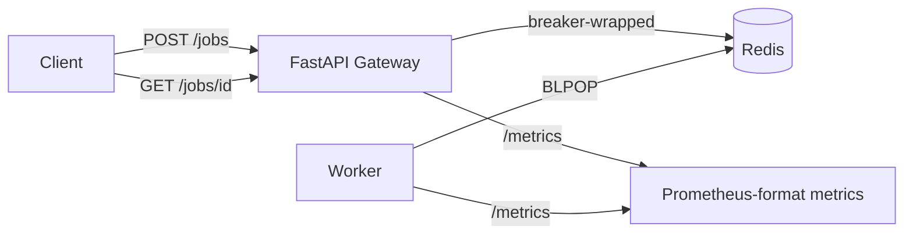

# cicd-security-pipeline

A small distributed job-processing app used as a testbed for a CI/CD pipeline
that actually does something: automated tests gating every change, and
vulnerability scanners wired directly into the merge request workflow.

- **Code lives on GitHub:** you're looking at it.
- **Pipeline lives on GitLab:** [gitlab.com/abdelwb/cicd-security-pipeline](https://gitlab.com/abdelwb/cicd-security-pipeline) —
  that's where `.gitlab-ci.yml` actually runs, because the point of this repo
  is demonstrating GitLab CI/CD and MR-integrated security scanning, not just
  writing the YAML for show. GitHub Actions runs a lightweight lint/test/build
  mirror (`.github/workflows/ci.yml`) so this copy stays green too.

## Architecture



- **gateway** ([gateway/main.py](gateway/main.py)) — FastAPI service. Accepts
  job submissions, applies backpressure once the Redis queue is too long,
  and exposes `/health`, `/ready`, and `/metrics`.
- **worker** ([worker/worker.py](worker/worker.py)) — pulls jobs off the
  Redis list with `BLPOP`, updates job status, and understands a few
  `simulate` directives for testing failure modes (see below).
- **common** ([common/](common/)) — shared settings, Redis client, and the
  circuit breaker both services wrap around every Redis call.

## Run it locally

```bash
docker compose up --build
```

or use the smoke-test script, which also submits a sample job:

```bash
./scripts/run_local.sh
```

- Gateway: http://localhost:8000 (`/health`, `/ready`, `/metrics`, `/jobs`)
- Worker metrics: http://localhost:9100

## Failure-mode demos

Every demo is triggered through the normal `/jobs` API — nothing needs to be
rebuilt.

**Circuit breaker (Redis down).** Stop Redis while the gateway is running:

```bash
docker compose stop redis
curl -i -X POST localhost:8000/jobs -d '{"payload":{}}' -H 'content-type: application/json'
# first few calls fail slowly, then the breaker opens and every call fails
# fast with 503 until the reset timeout elapses and one probe is let through
curl -s localhost:8000/metrics | grep circuit_breaker_state
```

**Backpressure.** Push the queue past `MAX_QUEUE_LENGTH` (default 50) and new
submissions are rejected with `503` + `Retry-After` instead of queuing
forever:

```bash
for i in $(seq 1 60); do
  curl -s -o /dev/null -w '%{http_code}\n' -X POST localhost:8000/jobs \
    -d '{"payload":{"simulate":"slow","duration_s":30}}' -H 'content-type: application/json'
done
```

**OOM simulation.** Submit a job that allocates memory in the worker; under
k3s with the memory limit set in [k8s/worker-deployment.yaml](k8s/worker-deployment.yaml),
the kubelet OOMKills the pod and you can watch it restart:

```bash
curl -X POST localhost:8000/jobs -H 'content-type: application/json' \
  -d '{"payload":{"simulate":"oom","size_mb":512}}'
kubectl -n job-pipeline get pods -w
```

## Deploying to k3s

```bash
./scripts/build_images.sh v0.1
kubectl apply -f k8s/namespace.yaml -f k8s/configmap.yaml \
  -f k8s/redis-deployment.yaml -f k8s/gateway-deployment.yaml \
  -f k8s/worker-deployment.yaml -f k8s/hpa.yaml
```

## CI/CD & security automation

This is the part the rest of the repo exists to exercise. `.gitlab-ci.yml`
defines:

| Stage | Job(s) | What it does |
|---|---|---|
| lint | `lint` | `ruff check .` |
| test | `test` | pytest with coverage; JUnit + Cobertura reports surface pass/fail and coverage directly in the MR |
| test | `sast` (semgrep), `secret_detection` | GitLab-managed scanners (via `include: template:`), findings shown in the MR Security widget |
| build | `build` | builds & pushes `gateway`/`worker` images to the project's Container Registry |
| security | `container_scanning`, `container_scanning_worker` | scans the two images just built for known CVEs |
| security | `pip-audit` | audits our actual Python dependencies — see below for why this exists instead of GitLab's Dependency Scanning |

The `workflow: rules` block runs this as a **merge request pipeline** whenever
an MR is open (falling back to a branch pipeline on `main` otherwise), which
is what makes GitLab attach scanner results to the MR itself instead of a
report nobody opens — a reviewer sees new/fixed vulnerabilities inline before
approving, the same way they see the diff. Getting the scanners to actually
run on MR pipelines needed one more thing: GitLab's security templates
default to running only on **branch** pipelines (to avoid double-scanning an
MR and its target branch), so `AST_ENABLE_MR_PIPELINES: "true"` is set
explicitly — without it, `sast`/`secret_detection`/`container_scanning` never
appear in the MR pipeline at all, silently, with no error.

`.github/workflows/ci.yml` runs a smaller lint/test/build job on GitHub so
this mirror's checks stay green; it isn't where the security scanning story
lives.

## Vulnerability triage

Running actual scanners against actual dependencies surfaces actual noise.
Here's what showed up and what I did about each kind, working end to end
through GitLab's [merge request !1](https://gitlab.com/abdelwb/cicd-security-pipeline/-/merge_requests/1):

**A real, fixed vulnerability.** `pip-audit` flagged 14 known CVEs in
`starlette 0.38.6`, pulled in transitively by `fastapi==0.115.0` — a couple
of them genuinely exploitable (a DoS via unbounded form-field buffering, an
SSRF via UNC-path resolution on Windows, a Host-header/path confusion that
could bypass path-based auth checks). Fix: bumped to `fastapi==0.141.1`,
which requires `starlette>=0.46.0` and pulls a version with every one of
those patched. Verified by rerunning the pipeline: `test` and `build` still
pass (13/13 tests, same coverage), and `pip-audit` goes from 14 findings to
`No known vulnerabilities found`. This is the difference between "turned on
a scanner" and "used one" — the finding was real, the fix was real, and the
pipeline is what proved neither broke anything.

**Dependency Scanning that doesn't run, on purpose.** `.gitlab-ci.yml` still
`include`s `Security/Dependency-Scanning.gitlab-ci.yml`, but it never
contributes a job here: GitLab's `gemnasium-python-dependency_scanning` gates
on `$GITLAB_FEATURES =~ /\bdependency_scanning\b/`, a paid-tier flag this
Free namespace doesn't have (unlike SAST and Secret Detection, which have no
such gate). Rather than leave Python dependencies unscanned, the `pip-audit`
job above is a free, direct substitute — same idea (audit declared
dependencies against a known-vulnerability database), different tool. It's
literally how it found the starlette CVEs above.

**Container-scanning noise that isn't noise, exactly — just not ours.** The
`container_scanning` jobs report dozens of CVEs in the `python:3.12-slim`
base image: glibc, perl, util-linux, tar, gzip, sqlite, systemd libraries,
PAM. Three are rated Critical, all in `perl-base` (Archive::Tar and regex
bugs) — but this application never invokes Perl; it's bundled OS tooling
Debian ships regardless. GitLab's container-scanning job sets
`allow_failure: true` by default specifically because this is expected: the
job's role is to surface findings for a human to triage in the MR, not to
block a merge on every base-image patch level. No code change here — the
judgment call itself (which findings are reachable, which aren't) is the
point of running the scanner in the first place. Rebuilding periodically
against a fresher base image tag is the actual mitigation for this category,
same as it would be for any container.

## Project layout

```
gateway/    FastAPI job-submission service
worker/     Redis-backed job processor + failure-mode simulators
common/     shared settings, Redis client, circuit breaker
tests/      pytest suite (fakeredis-backed, no external services needed)
k8s/        k3s manifests
scripts/    local build/run helpers
```
